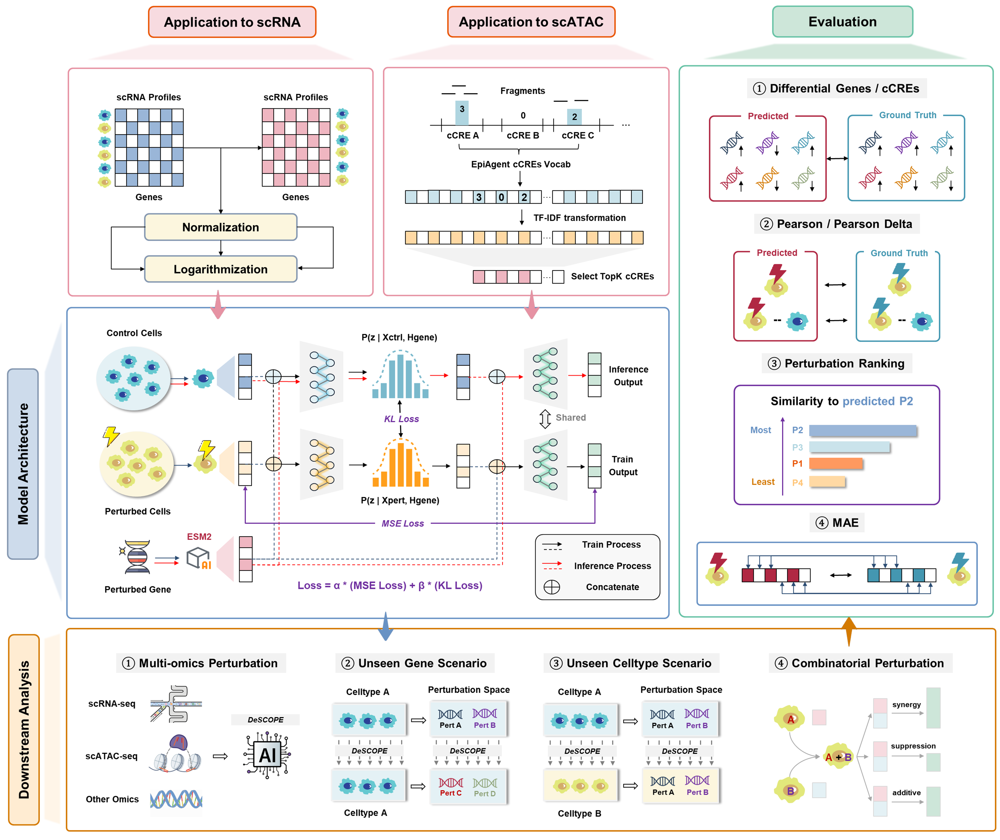

<p align="center">
  
</p>

<p align="center">
  <a href="https://pypi.org/project/descopex/"></a>
  <a href="https://pepy.tech/project/descopex"></a>
  <a href="https://descope.readthedocs.io/en/latest/"></a>
  <a href="https://github.com/Peg-Wu/DeSCOPE/blob/main/LICENSE"></a>
  <a href="https://github.com/Peg-Wu/DeSCOPE/releases"></a>
</p>

<h3 align="center">
  <p>
    DeSCOPE: Decoding Single-Cell Observations of Perturbed Expression
  </p>
</h3>

<p align="center">
  
</p>

DeSCOPE is a single-cell perturbation prediction framework designed for scRNA-seq, scATAC-seq, and general single-cell–level perturbation modeling. It is built on a conditional Variational Autoencoder (cVAE) architecture, in which perturbed genes are represented by embeddings derived from the ESM2 protein language model and used as conditioning information to model cellular responses to genetic perturbations. Through this design, DeSCOPE delivers strong predictive performance in challenging scenarios, including unseen genes and unseen cell types.

---

## Installation

### Environment Setup

### Step 1: Set up a python environment

We recommend creating a virtual Python environment with [Anaconda](https://docs.anaconda.com/free/anaconda/install/linux/):

- Required version: `python >= 3.10`

```bash
conda create -n descope python=3.10
conda activate descope
```

### Step 2: Install pytorch

Install `PyTorch` based on your system configuration. Refer to [PyTorch installation instructions](https://pytorch.org/get-started/previous-versions/).

For the exact command, for example:

- You may choose any version to install, but make sure the PyTorch version is not too old.
- We recommend `torch ≥ 2.6`.

```bash
# Installation Example: torch v2.7.1
# CUDA 11.8
pip install torch==2.7.1 torchvision==0.22.1 torchaudio==2.7.1 --index-url https://download.pytorch.org/whl/cu118
# CUDA 12.6
pip install torch==2.7.1 torchvision==0.22.1 torchaudio==2.7.1 --index-url https://download.pytorch.org/whl/cu126
# CUDA 12.8
pip install torch==2.7.1 torchvision==0.22.1 torchaudio==2.7.1 --index-url https://download.pytorch.org/whl/cu128
```

### Step 3: Install deepspeed (optional)

Install `DeepSpeed` based on your system configuration. Refer to [DeepSpeed installation instructions](https://www.deepspeed.ai/tutorials/advanced-install/).

For the exact command, for example:

```bash
pip install deepspeed
```

### Step 4: Install descope and dependencies

To install `descope`, run:

```bash
pip install descopex
```

Or install from `github`:

```bash
git clone https://github.com/Peg-Wu/DeSCOPE.git
cd DeSCOPE
pip install [-e] .
```

Check if installation was successful:

```python
import descope
descope.welcome()
```

## Datasets Zoo

### scRNA-seq

|                            Paper                             |        Dataset         |                        Download Link                         |
| :----------------------------------------------------------: | :--------------------: | :----------------------------------------------------------: |
| [Replogle et al., 2022](https://www.cell.com/cell/fulltext/S0092-8674(22)00597-9) |   K562_GWPS (61.3GB)   | [download](https://plus.figshare.com/ndownloader/files/35775507) |
| [Replogle et al., 2022](https://www.cell.com/cell/fulltext/S0092-8674(22)00597-9) | K562_ESSENTIAL (9.9GB) | [download](https://plus.figshare.com/ndownloader/files/35773219) |
| [Replogle et al., 2022](https://www.cell.com/cell/fulltext/S0092-8674(22)00597-9) |      RPE1 (8.1GB)      | [download](https://plus.figshare.com/ndownloader/files/35775606) |
| [Nadig et al., 2025](https://www.nature.com/articles/s41588-025-02169-3) |     HEPG2 (5.2GB)      | [download](https://www.ncbi.nlm.nih.gov/geo/download/?acc=GSE264667&format=file&file=GSE264667%5Fhepg2%5Fraw%5Fsinglecell%5F01%2Eh5ad) |
| [Nadig et al., 2025](https://www.nature.com/articles/s41588-025-02169-3) |     JURKAT (8.7GB)     | [download](https://www.ncbi.nlm.nih.gov/geo/download/?acc=GSE264667&format=file&file=GSE264667%5Fjurkat%5Fraw%5Fsinglecell%5F01%2Eh5ad) |

- The H1 dataset was obtained from the [Virtual Cell Challenge 2025](https://virtualcellchallenge.org/). ([download](https://storage.googleapis.com/vcc_data_prod/datasets/state/competition_support_set.zip))
  - NOTE: ESM2 gene embeddings can also be obtained from here.


### scATAC-seq

- Cell-by-cCRE / Cell-by-peak: [Human-scATAC-Corpus](https://health.tsinghua.edu.cn/human-scatac-corpus/download.php)

## Acknowledgements

We sincerely thank the authors of following open-source projects:

<details>
<summary>Click to expand</summary>

- [PyTorch](https://github.com/pytorch/pytorch)
- [Transformers](https://github.com/huggingface/transformers)
- [Datasets](https://github.com/huggingface/datasets)
- [Accelerate](https://github.com/huggingface/accelerate)
- [Scanpy](https://github.com/scverse/scanpy)
- [cell-eval](https://github.com/ArcInstitute/cell-eval)
- [STATE](https://github.com/ArcInstitute/state)
- [scGPT](https://github.com/bowang-lab/scGPT/tree/main)
- [EpiAgent](https://github.com/xy-chen16/EpiAgent)
- [GEARS](https://github.com/snap-stanford/GEARS)
- [wppkg](https://github.com/Peg-Wu/wppkg)

</details>

---

## Star History

<p align="center">
  <a href="https://www.star-history.com/?repos=Peg-Wu%2FDeSCOPE&type=date&legend=top-left">
    
  </a>
</p>