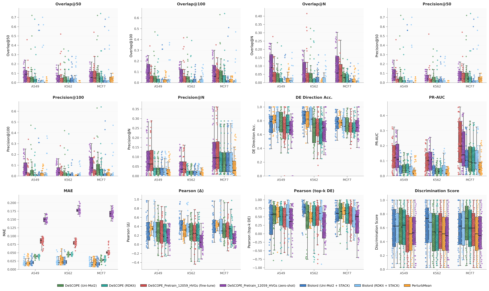

## 💊 scRNA Perturbation Prediction (Drug)

This tutorial provides a complete workflow for pretraining DeSCOPE on the full Tahoe-100M dataset and subsequently performing perturbation prediction on the Sci-Plex3 dataset through either direct inference or fine-tuning.

---

### 🔥 Pretrained Models

The original Tahoe-100M dataset contains approximately **60,000 genes**. To enable efficient model training and downstream inference, we applied gene filtering strategies based on highly variable genes (HVGs) and gene frequency analysis. The detailed preprocessing scripts are available at:

* `tahoe100m_pretrain/HVGs/calc_hvgs.py`
* `tahoe100m_pretrain/HVGs/calc_freq.ipynb`

We provide three pretrained DeSCOPE models with different gene vocabulary sizes. Each model is trained using a corresponding gene vocabulary file, allowing users to select an appropriate model according to their computational resources and application requirements.

> 🌏 All pretrained models were trained for 10 epochs with a batch size of 1024.

|       🎉 Pretrained Model       |                📚 Gene Vocabulary                |                  🤗 Hugging Face Repository                   |
| :----------------------------: | :---------------------------------------------: | :----------------------------------------------------------: |
|  `descope-tahoe100m-2k-hvgs`   |  `tahoe100m_pretrain/HVGs/merged_2k_hvgs.pkl`   | [Download Link](https://huggingface.co/wpp02/descope-tahoe100m-2k-hvgs) |
|  `descope-tahoe100m-5k-hvgs`   |  `tahoe100m_pretrain/HVGs/merged_5k_hvgs.pkl`   | [Download Link](https://huggingface.co/wpp02/descope-tahoe100m-5k-hvgs) |
| `descope-tahoe100m-12059-hvgs` | `tahoe100m_pretrain/HVGs/merged_12059_hvgs.pkl` | [Download Link](https://huggingface.co/wpp02/descope-tahoe100m-12059-hvgs) |

---

### ✨ Tips

Due to the unprecedented scale of the Tahoe-100M dataset, we adopted a **pretraining + fine-tuning** strategy to reduce redundant preprocessing and tokenization costs. Specifically, users can directly leverage the pretrained model and fine-tune it on downstream perturbation datasets.

Alternatively, if sufficient computational resources are available, users can adopt the **DeSCOPE_LOO** strategy, which follows the same leave-one-out training paradigm used for gene perturbation prediction. This approach enables more task-specific adaptation but requires substantially higher computational resources.

### 🏠 Performance

- The figure below illustrates the performance of DeSCOPE on the **Sci-Plex3** dataset.
- The pre-trained model (12059_hvgs) covers **482** out of 2,000 genes, and its metrics were calculated based on these 482 genes.
- The `DeSCOPE_Pretrain_12059_HVGs (zero-shot)` model exhibits a notably high DE overlap. This is a common phenomenon in perturbation tasks, where the **DE overlap on the validation set typically shows a continuous downward trend during training.**

